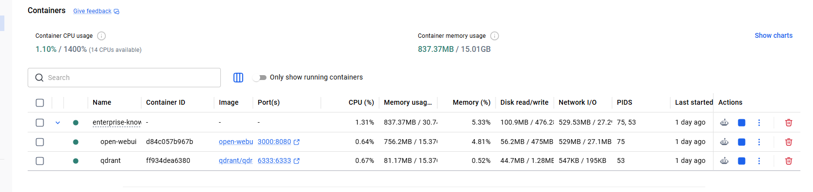

# Enterprise Knowledge Assistant

A fully local Retrieval-Augmented Generation (RAG) AI assistant that answers employee questions using company documents.

The project is being built from scratch as a learning journey into AI Engineering, Docker, Python, Vector Databases, and Enterprise AI solutions.

---

# Project Overview

The Enterprise Knowledge Assistant allows employees to ask questions in natural language and receive answers generated from internal company documents rather than relying only on the language model's built-in knowledge.

The entire solution runs locally using Ollama and Qdrant, ensuring company data remains private.

Current focus:
- Build the complete RAG pipeline
- Learn each component step by step
- Document every stage of the project
- Produce a portfolio-quality enterprise application

---

# Current Architecture

```text
                 User
                   │
                   ▼
          (Future Chat Interface)
                   │
                   ▼
               FastAPI API
                   │
                   ▼
              RAG Service
                   │
      ┌────────────┴────────────┐
      ▼                         ▼
Semantic Search            Phi-4 (Ollama)
      │
      ▼
   Qdrant
      │
      ▼
Company Documents (PDF)
```

---

# Technologies

| Technology | Purpose |
|------------|---------|
| Python | Backend development |
| Docker | Container management |
| Docker Compose | Multi-container orchestration |
| Ollama | Local AI model runtime |
| Phi-4 | Local Large Language Model |
| Qdrant | Vector database |
| LangChain | Embeddings and LLM integration |
| Open WebUI | Local AI interface |
| Git | Version control |
| GitHub | Source code management |

---

# Project Structure

```text
Enterprise-Knowledge-Assistant/

backend/
│
├── loaders.py
├── chunker.py
├── embeddings.py
├── vector_store.py
├── retrieval.py
├── rag.py
├── llm.py
├── ingest.py
└── tests/

sample_documents/
│
├── HR/
├── IT/
└── Cloud/

docker-compose.yml
requirements.txt
README.md
```

---

# Features Implemented

## Environment Setup

- Docker Desktop installed
- Docker Compose configured
- Python virtual environment
- Git repository
- GitHub repository



## Local AI

- Ollama installed
- Phi-4 downloaded
- Open WebUI configured
- Local AI tested successfully

## Knowledge Base

- Sample enterprise PDF documents
- Department-based folder organization
- Automatic PDF discovery

## Document Processing

- PDF loader
- Text extraction
- Recursive text chunking
- Chunk overlap

## Embeddings

- Local embedding generation
- nomic-embed-text model
- Embedding validation

## Vector Database

- Qdrant running in Docker
- Collection creation
- Collection recreation
- Vector storage
- Metadata storage

Stored metadata:

- Document text
- Source document
- Department

## Retrieval

- Semantic similarity search
- Configurable similarity threshold
- Retrieval evaluation
- Search scoring
- Context generation

## Local LLM

- Phi-4 integration
- Ollama connection
- Prompt generation
- LLM communication

---

# Project Progress

| Phase | Status |
|--------|--------|
| Docker Setup | ✅ |
| Ollama Setup | ✅ |
| Open WebUI | ✅ |
| GitHub Repository | ✅ |
| Docker Compose | ✅ |
| Sample Documents | ✅ |
| PDF Loader | ✅ |
| Text Chunking | ✅ |
| Embeddings | ✅ |
| Qdrant | ✅ |
| Document Ingestion | ✅ |
| Semantic Retrieval | ✅ |
| Context Builder | ✅ |
| Phi-4 Integration | ✅ |
| Complete RAG Pipeline | 🚧 |
| FastAPI | ⏳ |
| Chat Interface | ⏳ |
| SharePoint Integration | ⏳ |
| Azure Deployment | ⏳ |

---

# Learning Objectives

- AI Engineering
- Retrieval-Augmented Generation (RAG)
- Docker & Docker Compose
- Python Backend Development
- Vector Databases
- Prompt Engineering
- Local AI Models
- Enterprise Software Architecture
- Git & GitHub

---

# Screenshots

Screenshots will be added as the project progresses.

---

# Future Improvements

- Web chat interface
- FastAPI REST API
- SharePoint Online integration
- Azure Blob Storage integration
- Authentication
- Conversation memory
- Source citation
- Streaming responses
- Azure AI Search
- Azure OpenAI
- Microsoft Teams integration

---

# Author

Built as part of an AI Engineering learning journey focused on building real enterprise AI solutions from scratch.